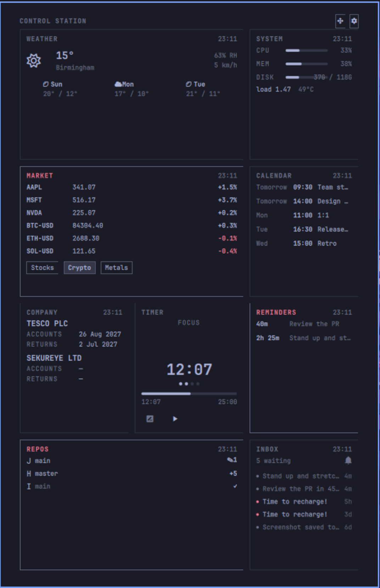
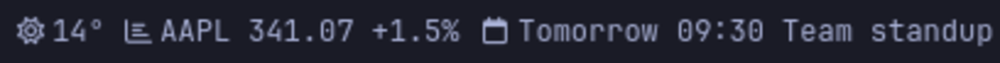
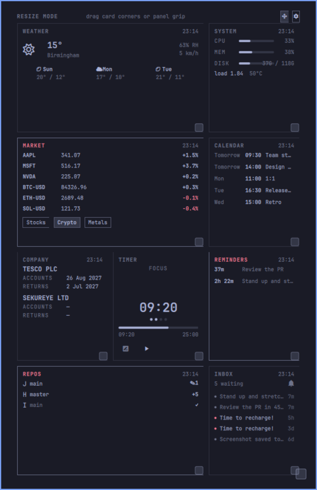
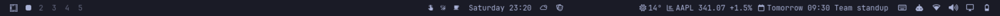
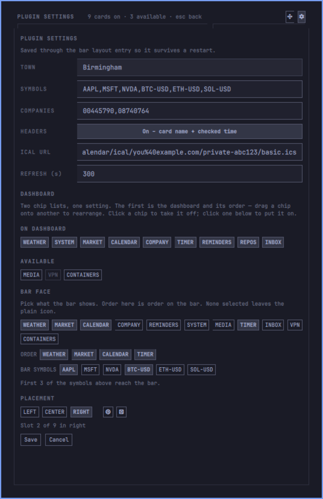

<div align="center">

# Control Station

**One panel for everything you keep checking.**

A bento-style dashboard for [Omarchy](https://omarchy.org). Twelve cards —
weather, markets, calendar, filings, system, reminders, media, timer,
notifications, VPN, containers, git repos — that you pick, arrange and resize
yourself. Then pick any of those same cards to ride inline in your bar, so the
things you check constantly never need a click at all.

[](https://omarchy.org)
[](https://hyprland.org)
[](https://quickshell.org)
[](LICENSE)
[](CONTRIBUTING.md)





<sub>Screenshots show a demo setup. Calendar and reminder entries are made up;
everything else is live.</sub>

</div>

## Build the dashboard you actually want

- **Pick your cards.** Twelve to choose from, six sensible ones on by default.
  Cards that need configuring stay greyed out until they have what they need,
  with the reason written on them.
- **Drag to rearrange.** Drop any card on any other to swap their cells.
- **Resize anything.** Grab a card's corner and pull — spans from one cell up to
  a full 3-wide, 2-tall block. The grid reflows live around it.
- **Zoom the whole panel** from 75% to 160%, by setting or by dragging the
  corner grip.

Every arrangement persists. Close the panel, restart the shell, it comes back
exactly as you left it.



<sub>Resize mode. Every card grows a corner grip; the grid reflows live as you pull.</sub>

## Your bar, your way

Tick the cards you want inline in the bar and they render as live chips in your
chosen order — `18°C ☀ · AAPL +1.2% · 3 reminders` — or leave it empty for a
plain icon. Market chips take a symbol subset of their own, so the bar stays
short while the panel stays complete. Move the widget between bar sections and
slots from inside the plugin's own settings; no config file editing.



<sub>The whole bar. The chips sit in whichever section and slot you pick.</sub>

## The cards

| | |
|---|---|
| **Weather** | Current conditions and a 3-day forecast, with type-ahead town search |
| **Market** | Live quotes and day change for any symbols you list, plus one-tap presets |
| **Calendar** | Your next events, timed or all-day, from a Google Calendar secret iCal link |
| **Companies House** | Next UK filing deadline, for one company or several, flagged when it's close |
| **Reminders** | What Omarchy reminders are still waiting on you |
| **System** | CPU, memory, disk and temperature |
| **Media** | Now playing with real transport controls — play/pause, skip, and cycle between players |
| **Timer** | Focus timer and stopwatch, with a chime and a desktop notification. A running timer survives a shell restart and resumes where it really is, not where it was |
| **Inbox** | Recent notifications, urgency-aware, with do-not-disturb and clear-history in the card |
| **VPN** | NetworkManager VPN connections, toggled up and down in place |
| **Containers** | Every Docker container and its state, with honest errors — no socket, no permission, or no binary |
| **Repos** | Your git working trees: branch, ahead/behind, staged vs. dirty at a glance |

## Fast and honest

- **One heartbeat, no stampede.** A single timer drives every fetcher on a
  stagger, and the bar and the panel share one set of fetches instead of
  duplicating them.
- **Every card says when it last checked.** No silently stale numbers.
- **A failed fetch keeps the last good data** and marks itself, rather than
  blanking the card.
- **No API keys, anywhere.** Open-Meteo, Yahoo Finance, Companies House open
  data, your own iCal link, and local tools you already have.

## Keyboard-first if you want it

| Key | Does |
|---|---|
| Arrows | Move the cursor across the bento |
| Enter | Re-fetch the focused card |
| `r` | Refresh everything |
| `m` | Open the card picker |
| Tab | Switch to the next panel |
| Esc | Close |

Nothing needs a mouse.

## Also a window

Beyond the bar, the dashboard is a panel module in its own right:

```bash
omarchy-shell shell summon justarieldotcom.control-station '{}'
```

Bind it to a key and summon the whole thing without a bar widget at all.

## Install

```bash
omarchy plugin add https://github.com/justarieldotcom/omarchy-control-station.git --enable
```

That validates the plugin, installs it as
`~/.config/omarchy/plugins/justarieldotcom.control-station` and loads it into
the running shell — no restart.

Then pick **Control Station** from the bar widget picker, or add it to a bar
section in `~/.config/omarchy/shell.json`:

```json
{ "id": "justarieldotcom.control-station" }
```

## Update

```bash
omarchy plugin update justarieldotcom.control-station
```

## Uninstall

```bash
omarchy plugin remove justarieldotcom.control-station
```

That unloads the widget, drops its bar entry from `~/.config/omarchy/shell.json`
and deletes the plugin folder. Control Station writes nowhere else.

## Configure

Everything is editable from the gear inside the panel — the fields up top, then
the two chip lists that choose what's on the dashboard and what's on the bar,
then where the widget sits:



Every setting is also a key on that bar entry:

| Setting | What it is |
|---|---|
| `cards` | Which cards are on the dashboard, in display order |
| `barItems` | Which of those also show inline in the bar, in order |
| `barSymbols` | Up to 3 market symbols that reach the bar |
| `weatherTown` | Town name for Open-Meteo geocoding |
| `symbols` | Comma-separated Yahoo Finance symbols |
| `calendarIcalUrl` | Google Calendar secret iCal link (`basic.ics`) |
| `companiesHouseNumber` | UK company numbers, comma-separated |
| `repoPaths` | Git working trees for the Repos card (`~` expanded) |
| `vpnBackend` | `openvpn`, `openconnect` or any nmcli name |
| `showHeaders` | Card name and checked-at time in each header |
| `zoom` | Panel scale, 0.75–1.6 |
| `refreshIntervalSec` | Heartbeat interval, 60–3600 |

## Layout

| File | What it is |
|---|---|
| `manifest.json` | Two entry points (`bar-widget` and `panel`) and the settings schema |
| `BarWidget.qml` | The bar face: renders the chips, loads and drives the panel |
| `Panel.qml` | The dashboard: cards, fetchers, grid, drag/resize, settings editor, IPC |
| `Model.js` | Pure parsers and the card registry. No side effects |

`Model.js` is side-effect free and ships its own assertions, so the parsing is
testable without a running shell:

```bash
node -e "require('./Model.js').selfCheck()"
```

Adding a card is one entry in the `CARDS` registry plus its body component.

## Requirements

Omarchy 4+ with the Quickshell-based shell. `curl` for the network cards;
`docker`, `nmcli` and `git` only matter to the cards that use them, and the
picker tells you when one is missing.

## Contributing

Bug reports, cards and fixes welcome — see [CONTRIBUTING.md](CONTRIBUTING.md).

## License

MIT — see [LICENSE](LICENSE).
